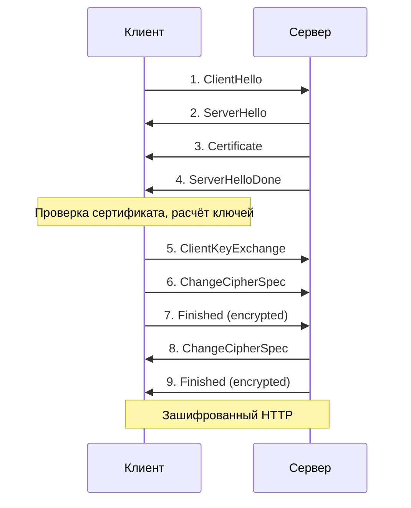

# HTTP и HTTPS — гайд для собеседования (Java Backend)

> **Цель:** технически точное, линейное объяснение от анатомии HTTP до TLS handshake и практики в Spring Boot — без вложенных списков, с чёткой иерархией глав.

## Table of Contents

- [Глава 1: HTTP — Анатомия и семантика протокола](#глава-1-http--анатомия-и-семантика-протокола)
- [Глава 2: Эволюция транспорта (HTTP/1.1 vs HTTP/2 vs HTTP/3)](#глава-2-эволюция-транспорта-http11-vs-http2-vs-http3)
- [Глава 3: Уязвимость HTTP и концепция HTTPS](#глава-3-уязвимость-http-и-концепция-https)
- [Глава 4: Криптографический фундамент](#глава-4-криптографический-фундамент)
- [Глава 5: Инфраструктура доверия (сертификаты и CA)](#глава-5-инфраструктура-доверия-сертификаты-и-ca)
- [Глава 6: Пошаговый TLS Handshake](#глава-6-пошаговый-tls-handshake)
- [Глава 7: Специфика для Java Backend](#глава-7-специфика-для-java-backend)
- [Глава 8: Готовая выжимка для собеседования](#глава-8-готовая-выжимка-для-собеседования)

---

## Глава 1: HTTP — Анатомия и семантика протокола

### Определение

**HTTP (HyperText Transfer Protocol)** — протокол **прикладного уровня** (Layer 7). Он задаёт **формат и смысл** сообщений между клиентом и сервером: что спросить, как передать метаданные, как интерпретировать ответ.

HTTP **не** создаёт физическое соединение и **не** шифрует данные. Доставку байтов выполняет **TCP** (по умолчанию порт **80**).

**Суть в одной фразе:** клиент отправляет структурированный **запрос** → сервер возвращает структурированный **ответ**.

### Связь с Docker: «голый» поток вниз по стеку

При разборе Docker мы видели **пирог слоёв**: read-only слои image + сверху writable **container layer**, который перекрывает видимость нижних уровней.

С HTTP — другая ось, но та же логика **передачи без трансформации на верхнем уровне**:

**Твой Spring `@RestController`** формирует JSON, заголовки, статус — это **прикладное сообщение HTTP**. Оно спускается вниз по сетевому стеку **как есть** (текстовые байты запроса/ответа). Ни TCP, ни IP **не меняют** структуру `POST /api/orders` и тело `{"quantity": 2}` — они только **доставляют** уже собранные байты.

| Docker (файловая система)        | HTTP (сеть)                                        |
| -------------------------------- | -------------------------------------------------- |
| Код пишет в `/app/config`        | Код формирует HTTP-запрос                          |
| OverlayFS склеивает слои в `/`   | TCP переносит байты без смены семантики HTTP       |
| Writable layer перекрывает lower | TLS (позже) оборачивает HTTP перед TCP             |
| Нижние слои image неизменны      | Смысл HTTP-сообщения не меняется при передаче вниз |

**Вывод для собеседования:** HTTP живёт **над** транспортом. Пока нет HTTPS, по проводу уходит **тот же текст**, который собрал Tomcat — как «прозрачная плёнка» без защитной обёртки.

### Модель «Запрос — Ответ»

Клиент **всегда инициирует** запрос. Сервер отвечает. В классическом HTTP сервер не открывает соединение к браузеру первым (исключения: WebSocket, SSE, long polling — но базовая модель та же).

### Stateless-природа

Каждый HTTP-запрос для протокола **самодостаточен**. Сервер **не обязан** хранить контекст прошлого вызова.

**Сессия** — надстройка приложения: **Cookie**, **JWT** в `Authorization`, **server-side session id**. Протокол лишь предоставляет заголовки; память о пользователе — ответственность backend.

### Структура текстового сообщения

#### Запрос

```http
POST /api/orders HTTP/1.1
Host: api.example.com
Content-Type: application/json
Authorization: Bearer eyJhbGciOi...
Content-Length: 42

{"productId": 10, "quantity": 2}
```

**Стартовая строка** — метод, путь, версия протокола.

**Заголовки** — пары `Key: Value` (метаданные, авторизация, тип тела).

**Пустая строка** — граница заголовков и тела.

**Тело** — опционально: JSON, XML, `multipart/form-data`.

#### Ответ

```http
HTTP/1.1 201 Created
Content-Type: application/json
Location: /api/orders/550e8400-e29b-41d4-a716-446655440000

{"id":"550e8400-e29b-41d4-a716-446655440000","status":"NEW"}
```

**Статус-строка** — версия, **числовой код**, фраза.

**Заголовки** и **тело** — по тем же правилам.

### Методы HTTP и идемпотентность

| Метод      | Назначение              | Идемпотентен? | Безопасен? |
| ---------- | ----------------------- | ------------- | ---------- |
| **GET**    | Получить ресурс         | Да            | Да         |
| **HEAD**   | Метаданные без тела     | Да            | Да         |
| **PUT**    | Заменить ресурс целиком | Да            | Нет        |
| **DELETE** | Удалить ресурс          | Да            | Нет        |
| **POST**   | Создать / команда       | **Нет**       | Нет        |
| **PATCH**  | Частичное обновление    | Обычно нет    | Нет        |

**Идемпотентность:** повторный запрос с теми же параметрами не должен давать **дополнительный** эффект сверх первого успешного (на практике `PUT`/`DELETE` проектируют так; `POST` для платежей требует **idempotency key**).

**Безопасный метод** — не меняет состояние сервера (только чтение).

### Группы статус-кодов

| Диапазон | Класс         | Смысл                                                                |
| -------- | ------------- | -------------------------------------------------------------------- |
| **1xx**  | Informational | Промежуточно (редко в REST API)                                      |
| **2xx**  | Success       | Успех: **200** OK, **201** Created, **204** No Content               |
| **3xx**  | Redirection   | Перенаправление: **301**, **302**, **304** Not Modified              |
| **4xx**  | Client Error  | Ошибка клиента: **400**, **401**, **403**, **404**, **409**, **422** |
| **5xx**  | Server Error  | Ошибка сервера: **500**, **502**, **503**, **504**                   |

На собеседовании важно: код — **контракт** для клиента и мониторинга; не подменяй **401** (не аутентифицирован) и **403** (нет прав).

### Порты и стек доставки

| Протокол  | Порт по умолчанию | Роль                                 |
| --------- | ----------------- | ------------------------------------ |
| **HTTP**  | 80                | Прикладные сообщения в открытом виде |
| **HTTPS** | 443               | HTTP внутри TLS                      |

Цепочка для HTTP: **Приложение → HTTP → TCP → IP → L2**.

---

## Глава 2: Эволюция транспорта (HTTP/1.1 vs HTTP/2 vs HTTP/3)

Семантика HTTP (методы, коды, заголовки) **общая**. Меняется **эффективность переноса** байтов по сети.

| Критерий              | HTTP/1.1                                         | HTTP/2                          | HTTP/3                          |
| --------------------- | ------------------------------------------------ | ------------------------------- | ------------------------------- |
| Транспорт             | TCP                                              | TCP                             | **QUIC (UDP)**                  |
| Соединения            | **Keep-Alive** — несколько запросов на одном TCP | Один TCP, много **streams**     | QUIC + streams                  |
| Head-of-line blocking | Очередь запросов на одном TCP                    | Blocking на уровне TCP остаётся | Меньше блокировок между streams |
| Формат на wire        | Текст                                            | Бинарные **фреймы**             | Бинарные фреймы в QUIC          |
| Сжатие заголовков     | Нет (дублирование)                               | **HPACK**                       | **QPACK**                       |
| Типичный порт         | 80 / 443                                         | 80 / 443                        | 443 (QUIC)                      |

### HTTP/1.1 и Keep-Alive

Раньше: один запрос → закрытие TCP → новый запрос → новый TCP (дорого).

**Keep-Alive:** одно TCP-соединение обслуживает **цепочку** запросов. Меньше handshake, выше latency на пиковых API.

Проблема: параллельные запросы к одному хосту часто открывали **несколько TCP** (browser connection limits) — **head-of-line blocking**.

### HTTP/2 и мультиплексирование

Несколько логических **потоков (streams)** в **одном** TCP. Заголовки сжимаются (**HPACK**). Server push (редко в REST).

Плюс: эффективнее загрузка страниц и API с множеством параллельных вызовов.

Минус: потеря одного TCP-пакета может задержать **все** streams на этом соединении.

### HTTP/3 и QUIC

HTTP поверх **QUIC** на **UDP**: встроенное шифрование, независимые streams, быстрее recovery при потере пакетов.

Для backend-разработчика: знать, что **Ingress/Nginx** может терминировать HTTP/2/3, а в pod всё ещё HTTP/1.1 — это нормальная схема.

---

## Глава 3: Уязвимость HTTP и концепция HTTPS

### Проблема «голого текста»

В чистом HTTP байты запроса и ответа на пути (Wi‑Fi, ISP, корпоративный proxy, tcpdump на хосте) читаются **как текст**: URL, **Authorization**, cookies, JSON с PII.

Это не баг реализации — **контракт протокола** без слоя шифрования.

### Три кита безопасности (что даёт HTTPS)

| Свойство                   | Что защищает                        | Без TLS                   |
| -------------------------- | ----------------------------------- | ------------------------- |
| **Конфиденциальность**     | Содержимое не читается посторонними | Утечка токенов, паролей   |
| **Целостность**            | Подмена ciphertext обнаруживается   | MITM может подменить JSON |
| **Аутентификация сервера** | Домен связан с сертификатом         | Фишинг на чужой IP        |

**HTTPS** = **HTTP + TLS**. Порт **443**. Семантика API **не меняется** — меняется оболочка передачи.

### Аналогия с Docker: TLS как защитный upper layer

В Docker **container layer (writable)** лежит **над** read-only слоями image:

- нижние слои **неизменны**;
- верхний **перехватывает** запись и **перекрывает** то, что видит процесс;
- снаружи контейнер видит **единый `/`**, не отдельные плёнки.

**TLS** работает похоже на границе **HTTP → TCP**:

- **HTTP** по-прежнему формирует тот же текстовый запрос (как файлы в «логическом» слое приложения).
- **TLS** — **wrapper**: перехватывает байты HTTP, **шифрует** их, отдаёт в TCP **уже ciphertext**.
- Для сетевого анализатора без ключей виден шум, не `Authorization: Bearer ...`.
- **HTTP-слой «образа»** (смысл сообщения) не меняется; **транспортный вид** — да, как writable layer меняет представление файлов без порчи image.

```
HTTP-only:   [ HTTP текст ] ──────────────────→ TCP :80

HTTPS:       [ HTTP текст ] → [ TLS шифрование ] → TCP :443
                              ↑
                    «защитный слой» поверх HTTP
```

**Важно:** TLS защищает **канал**, не **бизнес-логику**. **RBAC**, **JWT**, **OAuth2** — по-прежнему в приложении.

---

## Глава 4: Криптографический фундамент

### Симметричное шифрование

**Один ключ** шифрует и расшифровывает. Быстро (**AES-GCM**, **ChaCha20-Poly1305**).

**Проблема:** как безопасно передать этот ключ по сети, если канал ещё не защищён?

### Асимметричное шифрование

Пара ключей: **публичный** (всем) и **приватный** (только сервер). Данные, зашифрованные публичным ключом сервера, читает только владелец приватного.

Медленнее. Используется для **старта** доверия и обмена секретом, не для каждого HTTP-body.

### Комбинированная схема в HTTPS

| Фаза          | Алгоритм                        | Зачем                                          |
| ------------- | ------------------------------- | ---------------------------------------------- |
| Handshake     | Асимметрия (**RSA**, **ECDHE**) | Согласовать общий секрет, проверить сертификат |
| Передача HTTP | Симметрия (**AES-GCM**)         | Скорость на миллионах API-вызовов              |

**На пальцах:** асимметрия — «обмен конвертом с ключом у двери»; симметрия — «быстрый сейф на всю сессию».

---

## Глава 5: Инфраструктура доверия (сертификаты и CA)

### Что такое TLS-сертификат

**X.509 сертификат** — электронный документ, связывающий:

**Домен** (`api.example.com` в SAN/CN) + **публичный ключ** + **подпись издателя**.

Клиент доверяет: «этот ключ принадлежит именно этому хосту».

### Роль Центра сертификации (CA)

**CA** подписывает сертификат сервера своим корневым/промежуточным ключом. Браузер и JVM хранят список **доверенных корней** (`cacerts`).

Цепочка: **Leaf (сервер) → Intermediate CA → Root CA**.

### Как JVM и браузер проверяют цепочку

**Срок действия** — notBefore / notAfter.

**Имя хоста** — совпадение с **SNI** и URL (`HTTPS hostname verification`).

**Подпись** — каждый уровень подписан вышестоящим до корня из trust store.

**Отзыв** — OCSP / CRL (зависит от настроек).

Провал любого шага → **`SSLHandshakeException`** / ошибка в браузере.

### Валидный vs Self-Signed

| Тип                                     | Кто подписал  | Прод                   | Dev                             |
| --------------------------------------- | ------------- | ---------------------- | ------------------------------- |
| **Публичный (Let's Encrypt, DigiCert)** | Доверенный CA | Да                     | Да                              |
| **Self-Signed**                         | Сам сервер    | Нет (браузер ругается) | Да, если добавить в trust store |

**Kubernetes:** **cert-manager** + Let's Encrypt. **Локально:** mkcert или импорт self-signed в JVM truststore.

---

## Глава 6: Пошаговый TLS Handshake

Рукопожатие — **договор о ключах и шифрах до первого HTTP-запроса**. Ниже — **TLS 1.2** (полная последовательность). В **TLS 1.3** меньше round-trip, но логика «сначала ключи, потом HTTP» та же.

**Предусловие:** TCP уже установлен (`SYN` → `SYN-ACK` → `ACK`).

### Схема



### Шаг 1 — ClientHello

Клиент → сервер: поддерживаемые версии **TLS**, список **cipher suites**, **random клиента**, **SNI** (`api.example.com`).

### Шаг 2 — ServerHello

Сервер → клиент: выбранная версия TLS, **один cipher suite**, **random сервера**.

### Шаг 3 — Certificate

Сервер → клиент: **цепочка сертификатов** (leaf + intermediate). Клиент начинает проверку доверия (Глава 5).

### Шаг 4 — ServerHelloDone

Сервер → клиент: сигнал «параметры сервера отправлены» (в TLS 1.2). Клиент может отправлять ключевой материал.

### Шаг 5 — ClientKeyExchange

Клиент генерирует секрет (**pre-master secret** / **ECDHE**). Передаёт серверу так, что прочитает только владелец **приватного ключа** сервера.

Обе стороны выводят **session keys** из random клиента, random сервера и общего секрета.

### Шаг 6 — ChangeCipherSpec (клиент)

Клиент → сервер: «переключаюсь на согласованное шифрование».

### Шаг 7 — Finished (клиент)

Клиент → сервер: проверочное сообщение **уже в шифре**. Подтверждает, что ключи совпали.

### Шаг 8 — ChangeCipherSpec (сервер)

Сервер → клиент: зеркальное переключение на шифр.

### Шаг 9 — Finished (сервер)

Сервер → клиент: **Finished** в шифре. Handshake завершён.

### После шага 9

По тому же TCP идут **зашифрованные** HTTP-запросы и ответы. Для Spring-кода это прозрачно: `GET /api/health` формируется как раньше; шифрует **JSSE/TLS**, не controller.

### TLS 1.3 (одной строкой)

Часто **1-RTT** вместо двух «половин» обмена; слабые cipher убраны. Java 11+ и современный Ingress используют 1.3 по умолчанию.

---

## Глава 7: Специфика для Java Backend

### Где живёт TLS в JVM

**JSSE** (Java Secure Socket Extension): **`SSLContext`**, **`SSLSocket`**, **`SSLEngine`**.

**`HttpsURLConnection`**, **`HttpClient` (Java 11+)**, **Spring `RestTemplate` / `WebClient`** — используют JSSE под капотом при URL `https://`.

### TrustManager и KeyStore

**TrustStore** — кому доверяем (CA для исходящих вызовов и проверки сервера).

**KeyStore** — наш сертификат + приватный ключ (для **входящего** HTTPS на Tomcat или **mTLS**).

Файл по умолчанию: **`$JAVA_HOME/lib/security/cacerts`**.

### Spring Boot

**Входящий HTTPS:** `server.port=8443`, `server.ssl.key-store=...`, `server.ssl.key-store-password=...`.

**Исходящий HTTPS:** настройка trust store для `WebClient` / `RestTemplate` при private CA или self-signed.

**За proxy:** приложение может видеть HTTP, пока клиент ↔ Ingress — HTTPS (**TLS termination**).

### TLS termination на Nginx / Ingress

**Клиент → HTTPS → Ingress/Nginx** — TLS заканчивается на proxy.

**Proxy → HTTP → Pod (Spring)** — внутри кластера может быть открытый HTTP.

Риск: трафик **между** proxy и pod не шифрован — компенсируют **NetworkPolicy**, **mTLS** (Istio/Linkerd), или **TLS passthrough** end-to-end.

### Частые ошибки и лечение

| Исключение / симптом              | Вероятная причина                          | Действие                                                   |
| --------------------------------- | ------------------------------------------ | ---------------------------------------------------------- |
| **`SSLHandshakeException`**       | Несовпадение cipher, протокол, битый chain | Проверить TLS версию, cipher, полную цепочку cert          |
| **`PKIX path building failed`**   | CA не в trust store                        | Импорт intermediate/CA в truststore                        |
| **`CertificateExpiredException`** | Просрочен cert                             | Обновить cert-manager / Let's Encrypt                      |
| **Hostname verification failed**  | SAN не совпадает с URL                     | Выпустить cert на правильный DNS                           |
| Self-signed в dev                 | Нет доверия JVM                            | `keytool -importcert` или dev-only `trust-all` (не в prod) |

---

## Глава 8: Готовая выжимка для собеседования

**~1.5 минуты, линейно:**

**HTTP** — прикладной протокол L7: **запрос–ответ**, **stateless**, текст (стартовая строка, заголовки, body). Методы и **идемпотентность** (`GET`/`PUT`/`DELETE` vs `POST`). Коды **2xx–5xx**. Порт **80**, доставка **TCP**. Данные уходят в стек **как есть** — без шифрования (аналогия: логический слой без «защитной плёнки», в отличие от Docker writable layer над image).

**Версии:** **1.1** Keep-Alive; **2** мультиплексирование в одном TCP; **3** QUIC/UDP.

**Проблема HTTP** — «голый текст» на проводе. **HTTPS** = HTTP + **TLS**, порт **443**. Три свойства: **конфиденциальность**, **целостность**, **аутентификация сервера**. TLS — **wrapper** над HTTP (как upper layer над read-only слоями).

**Крипто:** асимметрия на **handshake**, симметрия на **трафик**.

**Сертификат + CA**, проверка цепочки в JVM/браузере.

**Handshake (TLS 1.2):** ClientHello → ServerHello → Certificate → ServerHelloDone → ClientKeyExchange → ChangeCipherSpec → Finished (обе стороны) → зашифрованный HTTP.

**Java:** **JSSE**, TrustStore/KeyStore, **`SSLHandshakeException`**, Spring `server.ssl.*`, **TLS termination** на Ingress.

**Разделение:** TLS = **канал**; **JWT/RBAC** = **кто может вызвать API**.

---

## Итог

**HTTP** описывает _что_ передать. **TCP** доставляет байты. **HTTPS** добавляет **TLS** — защитный слой, который шифрует HTTP перед TCP и проверяет сертификат до первого `GET`. Для Java backend это прозрачный транспорт с чёткими точками отказа в trust chain и hostname verification.
